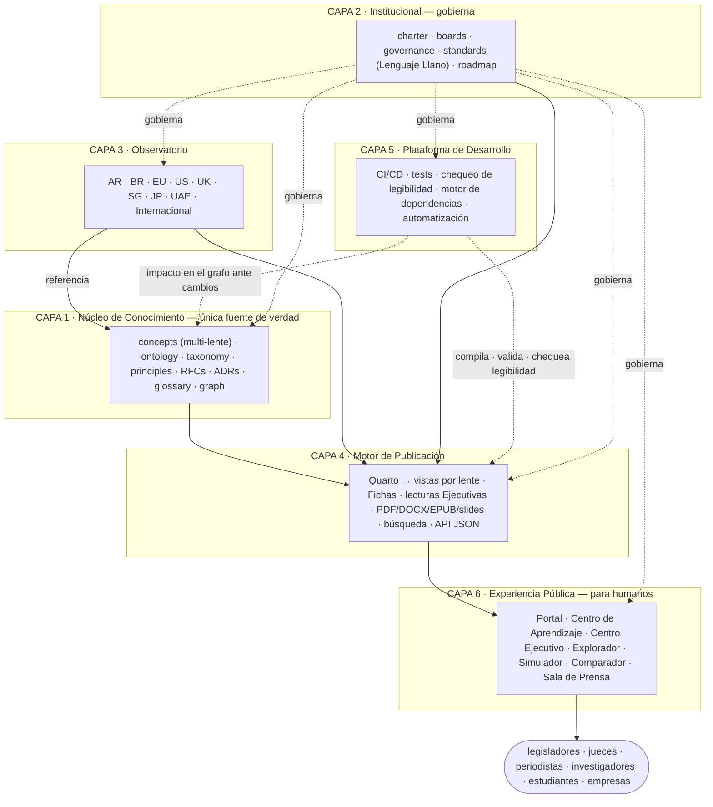

# ADR-0001 — Arquitectura de la Plataforma Institucional del BAFLP (v2)

**Estado:** APROBADO por el Editor en Jefe — registrado como el primer Registro de Decisión de Arquitectura.
**Reemplaza:** ARCH-0001 v1 (propuesta).
**Prioridad:** CRÍTICA — la implementación avanza por fases; la producción de contenido permanece suspendida hasta que la estructura de accesibilidad esté lista.
**Idioma maestro:** inglés · esta es la versión es-AR · también espejada en pt-BR.

> El BAFLP no es un libro ni un portal. Es una **Plataforma de Conocimiento Viva** — una institución
> internacional de investigación permanente. Un legislador, juez, periodista, investigador o empresa
> que abra **research.schadler.tech** debe pensar *"centro internacional de investigación"*, no
> *"GitHub lindo"*. La v2 agrega la capa y las reglas que hacen al Marco **accesible para humanos**
> —ciudadanos, profesionales e investigadores— sin sacrificar jamás el rigor. Los diagramas usan
> etiquetas canónicas en inglés; el rediseño es aditivo y preserva todo el historial de git.

---

## 0. Qué agrega la v2 respecto de la v1

- **Capa 6 — Experiencia Pública:** todo lo que los humanos usan (no los ingenieros).
- Un **modelo de accesibilidad de fuente única y múltiples lentes:** cada concepto se escribe una
  sola vez pero se renderiza para ciudadanos, profesionales e investigadores — sin textos paralelos
  que se desvíen entre sí.
- Una **Política de Lenguaje Llano**, exigida por un chequeo automático de legibilidad en CI.
- Nueva estructura por concepto: un campo `complexity`, tres lentes (llano / profesional /
  académico), más Ejemplo, Contraejemplo, Malentendidos Frecuentes, Implicancias Prácticas y un
  Visual.
- Artefactos generados: **Fichas de Concepto**, lecturas del **Centro Ejecutivo** (5 / 15 / 60 min),
  **Simulador de Decisión**, **Comparador Interactivo**, **Centro de Aprendizaje** (3 niveles).
- Una **política de automatización y edición:** las lentes y fichas se redactan automáticamente y se
  editan luego por humanos; los humanos editan *contenido*, nunca el *motor*.

---

## 1. Las seis capas — y dónde viven los diez bloques pedidos

| Capa | Nombre | Propósito |
|---|---|---|
| 1 | Núcleo de Conocimiento | Única fuente de verdad (conocimiento canónico) |
| 2 | Institucional | El BAFLP como institución internacional |
| 3 | Observatorio | Monitorear el mundo, por jurisdicción |
| 4 | Motor de Publicación | Generar todo automáticamente |
| 5 | Plataforma de Desarrollo | Ingeniería, CI/CD, validación, motor de dependencias |
| **6** | **Experiencia Pública** | **Todo lo que los humanos usan (NUEVO)** |

**Los diez bloques de mejora no son una sola capa — son tres.** Verlo es lo que los hace
construibles:

| Bloque | Vive en | Tipo |
|---|---|---|
| Campo `complexity` | Capa 1 (frontmatter del concepto) | contenido |
| Ejemplos (ejemplo · contraejemplo · malentendidos · implicancias) | Capa 1 (cuerpo del concepto) | contenido |
| Política de Lenguaje Llano | Estándar de Capa 2, exigido por CI de Capa 5 | regla |
| Capa Visual (un diagrama por concepto) | Fuente en Capa 1 + render en Capa 4 | contenido + generado |
| Fichas de Concepto (1 página · 3 min · académica · imprimible · slide) | Capa 4 (generado) | generado |
| Centro Ejecutivo (lecturas de 5 / 15 / 60 min) | Generado en Capa 4 + superficie en Capa 6 | generado |
| Centro de Aprendizaje (Ciudadano · Profesionales · Investigadores) | Capa 6 | experiencia |
| Simulador de Decisión | Lógica en Capa 6 + doctrina de clasificación en Capa 1 | experiencia |
| Comparador Interactivo | Capa 6 + datos del observatorio de Capa 3 | experiencia |
| Plataforma de Conocimiento Viva | toda la arquitectura | posicionamiento |

**Principio clave:** *la accesibilidad es una propiedad del Núcleo de Conocimiento, no un maquillaje
de front-end.* Se exige en la fuente y luego la capa de Experiencia Pública la expone.

---

## 2. Árbol del repositorio (v2)

```
baflp/
├── core/                          # CAPA 1 — Núcleo de Conocimiento (única fuente de verdad)
│   ├── ontology/  taxonomy/  concepts/  principles/  rfcs/
│   ├── adrs/                      #   Registros de Decisión de Arquitectura (este archivo = ADR-0001) [NUEVO]
│   ├── glossary/                  #   generado desde el frontmatter de los conceptos                  [NUEVO]
│   ├── graph/                     #   grafo de dependencias de conocimiento (graph.json)              [NUEVO]
│   └── metadata/                  #   esquemas de frontmatter, lentes y complejidad                   [NUEVO]
│
├── institution/                   # CAPA 2 — Institucional                                            [NUEVO]
│   ├── charter/  boards/  governance/  roadmap/
│   └── standards/                 #   nomenclatura · calidad · PLAIN-LANGUAGE-POLICY.md               [NUEVO]
│
├── observatory/                   # CAPA 3 — Observatorio (por jurisdicción)                          [NUEVO]
│   ├── argentina/ brazil/ european-union/ united-states/ united-kingdom/
│   └── singapore/ japan/ uae/ international/
│       #   cada una: legislation/ bills/ court-decisions/ academic-papers/ government-policies/
│       #             case-studies/ timeline.md status.md impact-assessment.md referenced-concepts.md
│
├── model-law/   registry/         # aplicación del Núcleo
│
├── public-experience/             # CAPA 6 — Experiencia Pública (humanos, no ingenieros)             [NUEVO]
│   ├── learning-center/           #   Nivel 1 Ciudadano · Nivel 2 Profesionales · Nivel 3 Investigadores
│   ├── executive-center/          #   lecturas de 5-min · 15-min · 1-hora · completa
│   ├── explorer/                  #   mapa de conocimiento / explorador de conceptos (app del portal)
│   ├── decision-simulator/        #   clasificador guiado (árbol de lógica; umbrales = doctrina)
│   ├── compare/                   #   vistas de comparación de jurisdicciones (sobre datos del Observatorio)
│   ├── press-room/                #   kit de prensa · comunicados · noticias · newsletter · destacados
│   └── README.md
│
├── website/   _quarto.yml         # CAPA 4 — Motor de Publicación (portal generado; solo el tema)
├── scripts/  tools/  tests/  api/  templates/  .github/  docs/   # CAPA 5 — Plataforma de Desarrollo
│
├── bibliography/                  # referencias centralizadas (BibTeX + CSL)     — soporta C1
├── assets/ figures/ diagrams/     # medios reproducibles (SVG · Mermaid)          — soporta C4
├── translations/                  # espejos es-AR · pt-BR (el inglés es el maestro) — transversal
├── releases/ downloads/ archive/ examples/ build/
└── CLAUDE.md · README.md · CHANGELOG.md · VERSION · CITATION.cff · LICENSE-CONTENT · LICENSE-CODE
```

El rediseño es **aditivo** más movimientos que preservan el historial; nada del repositorio actual
se sobrescribe.

---

## 3. Diagrama de arquitectura (v2)



---

## 4. El modelo de accesibilidad — "un concepto, múltiples lentes" (el corazón de la v2)

La tensión es real: **accesible Y riguroso.** La solución equivocada son dos textos —uno "fácil" y
uno "académico"— que se desvían y terminan contradiciéndose. La solución correcta es **una fuente,
múltiples lentes.**

Cada concepto se redacta **una sola vez** (su significado lo define el Arquitecto Jefe de
Investigación) con campos estructurados que permiten al sistema renderizar el *mismo* concepto a
través de distintas lentes:

```yaml
---
id: concept-0003
title: "Artificial Registry"
slug: artificial-registry
version: 0.1.0
status: draft
complexity: intermediate          # beginner | intermediate | advanced          [NUEVO]
category:
authority: chief-research-architect
summary: >                        # una oración; alimenta el glosario
relations: { depends-on: [], related-to: [], supersedes: null }
referenced-by: auto               # lo completa el motor del grafo
lenses: { citizen: true, professional: true, researcher: true }  # qué vistas generar [NUEVO]
references: []
---

## In one sentence (citizen)         # lenguaje llano, sin jerga
## In practice (professional)        # qué significa para un abogado / empresa / gestor público
## Formal definition (researcher)    # la definición canónica, rigurosa
## Example
## Counterexample
## Frequently misunderstood
## Practical implications
## Visual                            # referencia a diagrama (Mermaid/SVG)
## See also                          # referencias cruzadas resueltas automáticamente
```

De este **único archivo**, el Motor de Publicación genera: las tres vistas por lente
(ciudadano/profesional/investigador), una **Ficha de Concepto** de una página, una explicación de
tres minutos, una versión académica, una versión imprimible, una diapositiva y la entrada del
glosario. **Una fuente, muchas salidas — sin divergencia.** Así "accesible" se vuelve mecánica, no
promesa.

---

## 5. Política de Lenguaje Llano (estándar de Capa 2 · exigida en Capa 5)

Toda publicación oficial debe ser comprensible por un lector instruido. Todo concepto debe llevar una
definición académica, una explicación profesional, una explicación en lenguaje llano, un ejemplo y un
visual.

**Exigida, no esperada:** un **chequeo de legibilidad** en CI puntúa la lente ciudadano; si resulta
demasiado difícil (por encima de un nivel objetivo), el build marca el concepto. La accesibilidad se
testea.

---

## 6. Componentes de la Experiencia Pública (Capa 6)

- **Centro de Aprendizaje** — *Nivel 1 Ciudadano* (lenguaje llano, ejemplos, ilustraciones, sin
  jerga); *Nivel 2 Profesionales* (abogados, ingenieros, emprendedores, gestores públicos); *Nivel 3
  Investigadores* (lenguaje académico, referencias, teoría completa).
- **Centro Ejecutivo** — lecturas de 5 minutos, 15 minutos, 1 hora y completa. Diputados, jueces,
  ministros y ejecutivos no leerán 600 páginas; leerán un resumen de 5 minutos.
- **Simulador de Decisión** — un clasificador guiado basado en datos (por ej. los niveles ALP). El
  usuario responde *"¿hay supervisión humana? ¿posee bienes? ¿puede contratar?"* y recibe una
  clasificación con los conceptos y precedentes detrás. La cáscara es Capa 6; los umbrales de
  clasificación son **doctrina** (Capa 1, sujeta a RFC) — hasta aprobarse, corre en modo
  ilustrativo/borrador.
- **Comparador Interactivo** — jurisdicciones lado a lado (Argentina · Brasil · UE · EE. UU. …) sobre
  datos del Observatorio, para ver las diferencias sin leer cientos de páginas.
- **Explorador / Mapa de Conocimiento** — el grafo de conocimiento interactivo como superficie de
  navegación.
- **Sala de Prensa** — kit de prensa, comunicados, noticias, newsletter, destacados de investigación,
  conceptos y estudios de caso destacados.

**Generado vs interactivo:** las Fichas y las lecturas Ejecutivas son *generadas* (Capa 4) desde el
contenido del concepto; el Simulador, el Comparador, el Explorador y el Centro de Aprendizaje son
*superficies interactivas* (Capa 6). El portal sigue siendo estático + progresivo — sin necesidad de
un framework SPA pesado.

---

## 7. Pila tecnológica (agregados de la v2)

Todo lo de la v1 (Quarto · GitHub Actions · Pagefind · grafo en Python/D3 · GitHub Pages · SemVer ·
Mermaid) más:

| Aspecto | Tecnología | Por qué |
|---|---|---|
| Control de legibilidad | Métrica de legibilidad en Python (+ reglas de prosa Vale opcionales) en CI | Testea la Política de Lenguaje Llano automáticamente |
| Simulador de Decisión | Árbol basado en datos (YAML/JSON) renderizado por un script del portal | La lógica es dato; la doctrina queda en el Núcleo |
| Comparador Interactivo | Vista de datos sobre el Observatorio + `graph.json` | Sin contenido duplicado; lee de la fuente |
| Fichas / vistas por lente | Script generador sobre las secciones del concepto → páginas/tabsets Quarto | Una fuente, muchas salidas |

---

## 8. Pipeline de build y publicación (agregados de la v2)

El **build** (`scripts/build.sh`) ahora además: renderiza las tres vistas por lente de cada concepto;
genera Fichas y lecturas Ejecutivas; construye los datos del Simulador y del Comparador; y **corre el
chequeo de legibilidad** como parte de la validación. La **publicación** no cambia (push → deploy a
Pages; tag → release + archivo versionado). Sigue siendo un comando; sigue sin pasos manuales.

---

## 9. Grafo de dependencias (sin cambios — con una nota)

El modelo multi-lente **no** divide el grafo. Las lentes son vistas de un mismo nodo, así que un
concepto sigue siendo un único nodo con un único conjunto de relaciones. Cambiar un concepto sigue
mostrando cada documento afectado — en todas las lentes — mediante el mismo motor de impacto.

---

## 10. Responsabilidades de carpetas (agregados de la v2)

| Carpeta | Capa | Responsabilidad | Autoridad |
|---|---|---|---|
| `public-experience/*` | C6 | Superficies para el público (Aprendizaje/Ejecutivo/Simulador/Comparador/Prensa) | Consejo Editorial + Ingeniería |
| `institution/standards/PLAIN-LANGUAGE-POLICY.md` | C2 | La regla de accesibilidad | Editor en Jefe |
| `core/metadata/` (esquema de lentes + complejidad) | C1 | La forma de los conceptos accesibles | Arquitecto + Ingeniería |
| *(todas las filas de la v1 se mantienen)* | | | |

---

## 11. Riesgos (agregados de la v2)

| Riesgo | Severidad | Mitigación |
|---|---|---|
| Divergencia "accesible" vs "riguroso" | — | **Eliminada por las lentes de fuente única** (sin textos paralelos) |
| El Simulador es tan bueno como su doctrina | Media | Sale en modo ilustrativo hasta que la clasificación ALP sea aprobada por RFC |
| Calidad variable de las lentes autogeneradas | Media | Compuerta de validación humana; el motor nunca se edita para parchear contenido (§13) |
| Crecimiento descontrolado de la Experiencia Pública (prensa, newsletter…) | Media | Por fases: el portal sale primero con Centro de Aprendizaje + Explorador + Fichas |

*(Se mantienen los riesgos de la v1: enlaces de migración · deriva del grafo · carga del Observatorio
· cuello de botella de mantenedor único · limitación multiversión de Quarto · deriva de traducción ·
dependencia de GitHub.)*

---

## 12. Escalabilidad (nota de la v2)

Las lentes escalan por **generación**, no por trabajo de autoría extra más allá de los campos
estructurados. Agregar una cuarta lente luego (por ej. "estudiante") es un cambio de plantilla +
generador — no una reescritura de cada concepto.

---

## 13. Política de automatización y edición (decisión del Editor en Jefe)

- **Por ahora, todo automatizado.** Las lentes, ejemplos, Fichas y lecturas Ejecutivas se **redactan
  por la pipeline multi-IA** y se commitean.
- **El Editor en Jefe edita después** — directamente en los archivos de contenido (la prosa de las
  lentes del concepto).
- **Las ediciones nunca tocan el motor principal.** Los humanos editan *contenido*
  (`core/concepts/*`, `observatory/*`); el *motor* (`scripts/`, configuración de build, generadores)
  cambia solo por un PR de ingeniería, nunca para arreglar un contenido puntual. El generador
  permanece estable mientras el contenido sigue libremente editable.

---

## 14. Plan de migración (v2)

Cada fase es su propio PR validado y reversible. El historial se preserva en todo momento.

- **Fase 0 — Preservar.** Etiquetar el snapshot actual.
- **Fase 1 — Andamiaje aditivo.** Crear `institution/`, `observatory/`, `public-experience/`,
  `core/{adrs,graph,glossary,metadata}`; agregar la **Política de Lenguaje Llano** y la **plantilla
  de concepto multi-lente**; registrar **ADR-0001** (este documento).
- **Fase 2 — Movimientos que preservan el historial.** `comparative-law/` + estudios de caso →
  `observatory/`; **el PR #2 (Argentina) se mergea y luego migra a `observatory/argentina/`.**
- **Fase 3 — Motores.** Motor de dependencias (`graph-build`, `graph-impact`, `graph-integrity`) +
  el chequeo de legibilidad.
- **Fase 4 — Portal.** Navegación de seis capas, vistas por lente, Fichas, Centro Ejecutivo, Mapa de
  Conocimiento, Centro de Aprendizaje, selectores de versión/idioma.
- **Fase 5 — Interactividad de la Experiencia Pública.** Simulador de Decisión, Comparador
  Interactivo, Sala de Prensa; empaquetado de releases, archivo de versiones, API JSON.

---

## 15. El posicionamiento — una Plataforma de Conocimiento Viva

Todo está vivo: versionado, relacionado, ejemplificado, explicado en tres profundidades, con
infografías y (más adelante) video. La plataforma se construye para que, si la ONU, la OCDE, una
universidad o un parlamento quieren colaborar mañana, la estructura ya reciba investigadores,
revisores y nuevos estudios **sin reinventarse.** research.schadler.tech se vuelve **el lugar al que
el mundo va para entender la personalidad jurídica artificial** — ciudadano, juez, periodista,
ministro, universidad — con lenguaje llano para quien llega y profundidad completa para
investigadores y legisladores.

---

## 16. Compuerta de decisión — APROBADO

El Editor en Jefe aprobó la Capa 6 y el modelo de accesibilidad de fuente única y múltiples lentes.
Este documento se registra como **ADR-0001**; la implementación avanza según el plan por fases de la
§14. La producción de contenido se reanuda una vez que la estructura de accesibilidad (Fase 1) esté
lista.
