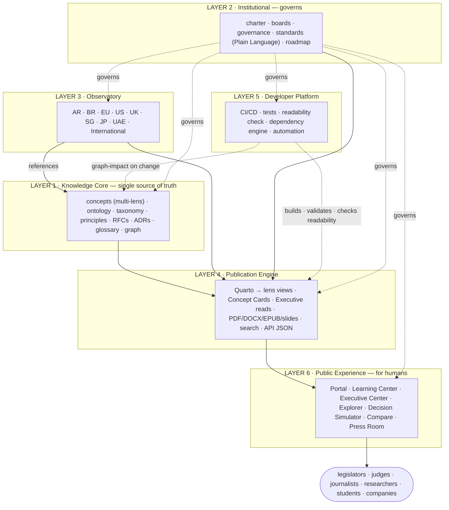

# ADR-0001 — BAFLP Institutional Platform Architecture (v2)

**Status:** APPROVED by the Chief Editor — recorded as the first Architecture Decision Record.
**Supersedes:** ARCH-0001 v1 (proposal).
**Priority:** CRITICAL — implementation proceeds by phases; content production stays suspended until the accessibility structure is in place.
**Master language:** English (this document) · mirrored in es-AR and pt-BR.

> The BAFLP is not a book and not a portal. It is a **Living Knowledge Platform** — a permanent
> international research institution. A legislator, judge, journalist, researcher or company that
> opens **research.schadler.tech** must think *"international research centre,"* not *"nice GitHub."*
> v2 adds the layer and the rules that make the Framework **accessible to humans** — citizens,
> professionals and researchers — without ever sacrificing rigour. Diagrams use canonical English
> labels; the redesign is additive and preserves all git history.

---

## 0. What v2 adds over v1

- **Layer 6 — Public Experience:** everything humans interact with (not engineers).
- A **single-source, multi-lens accessibility model:** every concept is written once but rendered
  for citizens, professionals and researchers — no parallel texts that drift apart.
- A **Plain Language Policy**, enforced by an automated readability check in CI.
- New per-concept structure: a `complexity` field, three lenses (plain / professional / academic),
  plus Example, Counterexample, Frequently Misunderstood, Practical Implications and a Visual.
- Generated artefacts: **Concept Cards**, **Executive Center** reads (5 / 15 / 60 min),
  **Decision Simulator**, **Interactive Compare**, **Learning Center** (3 levels).
- An **automation & editing policy:** lenses and cards are auto-drafted, human-edited; humans edit
  *content*, never the *engine*.

---

## 1. The six layers — and where the ten requested blocks live

| Layer | Name | Purpose |
|---|---|---|
| 1 | Knowledge Core | Single source of truth (canonical knowledge) |
| 2 | Institutional | BAFLP as an international institution |
| 3 | Observatory | Monitor the world, by jurisdiction |
| 4 | Publication Engine | Generate everything automatically |
| 5 | Developer Platform | Engineering, CI/CD, validation, dependency engine |
| **6** | **Public Experience** | **Everything humans interact with (NEW)** |

**The ten enhancement blocks are not one layer — they are three.** Seeing this is what makes them
buildable:

| Block | Lives in | Kind |
|---|---|---|
| `complexity` field | Layer 1 (concept frontmatter) | content |
| Examples (example · counterexample · misunderstood · implications) | Layer 1 (concept body) | content |
| Plain Language Policy | Layer 2 standard, enforced by Layer 5 CI | rule |
| Visual Layer (a diagram per concept) | Layer 1 source + Layer 4 render | content + generated |
| Concept Cards (1-page · 3-min · academic · printable · slide) | Layer 4 (generated) | generated |
| Executive Center (5 / 15 / 60 min reads) | Layer 4 generated + Layer 6 surface | generated |
| Learning Center (Citizen · Professionals · Researchers) | Layer 6 | experience |
| Decision Simulator | Layer 6 logic + Layer 1 classification doctrine | experience |
| Interactive Compare | Layer 6 + Layer 3 observatory data | experience |
| Living Knowledge Platform | the whole architecture | positioning |

**Key principle:** *accessibility is a property of the Knowledge Core, not a front-end skin.* It is
required at the source, then surfaced by the Public Experience layer.

---

## 2. Repository tree (v2)

```
baflp/
├── core/                          # LAYER 1 — Knowledge Core (single source of truth)
│   ├── ontology/  taxonomy/  concepts/  principles/  rfcs/
│   ├── adrs/                      #   Architecture Decision Records (this file = ADR-0001)      [NEW]
│   ├── glossary/                  #   generated from concept frontmatter                        [NEW]
│   ├── graph/                     #   knowledge dependency graph (graph.json)                   [NEW]
│   └── metadata/                  #   schemas for frontmatter, lenses & complexity              [NEW]
│
├── institution/                   # LAYER 2 — Institutional                                     [NEW]
│   ├── charter/  boards/  governance/  roadmap/
│   └── standards/                 #   naming · quality · PLAIN-LANGUAGE-POLICY.md               [NEW]
│
├── observatory/                   # LAYER 3 — Observatory (by jurisdiction)                     [NEW]
│   ├── argentina/ brazil/ european-union/ united-states/ united-kingdom/
│   └── singapore/ japan/ uae/ international/
│       #   each: legislation/ bills/ court-decisions/ academic-papers/ government-policies/
│       #         case-studies/ timeline.md status.md impact-assessment.md referenced-concepts.md
│
├── model-law/   registry/         # application of the Core
│
├── public-experience/             # LAYER 6 — Public Experience (humans, not engineers)         [NEW]
│   ├── learning-center/           #   Level 1 Citizen · Level 2 Professionals · Level 3 Researchers
│   ├── executive-center/          #   5-min · 15-min · 1-hour · complete reads
│   ├── explorer/                  #   interactive knowledge map / concept explorer (portal app)
│   ├── decision-simulator/        #   guided classifier (logic tree; thresholds = doctrine)
│   ├── compare/                   #   jurisdiction comparison views (over Observatory data)
│   ├── press-room/                #   media kit · press releases · news · newsletter · highlights
│   └── README.md
│
├── website/   _quarto.yml         # LAYER 4 — Publication Engine (portal generated; theme only)
├── scripts/  tools/  tests/  api/  templates/  .github/  docs/   # LAYER 5 — Developer Platform
│
├── bibliography/                  # centralized references (BibTeX + CSL)        — supports L1
├── assets/ figures/ diagrams/     # reproducible media (SVG · Mermaid)            — supports L4
├── translations/                  # es-AR · pt-BR mirrors (English is master)     — cross-cutting
├── releases/ downloads/ archive/ examples/ build/
└── CLAUDE.md · README.md · CHANGELOG.md · VERSION · CITATION.cff · LICENSE-CONTENT · LICENSE-CODE
```

The redesign is **additive** plus history-preserving moves; nothing in the current repository is
overwritten.

---

## 3. Architecture diagram (v2)



---

## 4. The accessibility model — "one concept, many lenses" (the heart of v2)

The tension is real: **accessible AND rigorous.** The wrong solution is two texts — an "easy" one
and an "academic" one — that drift apart and end up contradicting each other. The right solution is
**one source, multiple lenses.**

Every concept is authored **once** (its meaning owned by the Chief Research Architect) with
structured fields that let the system render the *same* concept through different lenses:

```yaml
---
id: concept-0003
title: "Artificial Registry"
slug: artificial-registry
version: 0.1.0
status: draft
complexity: intermediate          # beginner | intermediate | advanced          [NEW]
category:
authority: chief-research-architect
summary: >                        # one sentence; feeds the glossary
relations: { depends-on: [], related-to: [], supersedes: null }
referenced-by: auto               # filled by the graph engine
lenses: { citizen: true, professional: true, researcher: true }  # which views to generate [NEW]
references: []
---

## In one sentence (citizen)         # plain language, no jargon
## In practice (professional)        # what it means for a lawyer / company / public manager
## Formal definition (researcher)    # the canonical, rigorous definition
## Example
## Counterexample
## Frequently misunderstood
## Practical implications
## Visual                            # diagram reference (Mermaid/SVG)
## See also                          # auto-resolved cross-references
```

From this **single file**, the Publication Engine generates: the three lens views
(citizen/professional/researcher), a one-page **Concept Card**, a three-minute explanation, an
academic version, a printable version, a presentation slide, and the glossary entry. **One source,
many outputs — no divergence.** This is how "accessible" becomes mechanics, not a promise.

---

## 5. Plain Language Policy (Layer 2 standard · Layer 5 enforcement)

Every official publication must be understandable by an educated reader. Every concept must carry an
academic definition, a professional explanation, a plain-language explanation, an example and a
visual.

**Enforced, not hoped for:** a CI **readability check** scores the citizen lens; if it reads too
hard (above a target grade level), the build flags the concept. Accessibility is tested.

---

## 6. Public Experience (Layer 6) components

- **Learning Center** — *Level 1 Citizen* (plain language, examples, illustrations, no jargon);
  *Level 2 Professionals* (lawyers, engineers, entrepreneurs, public managers); *Level 3
  Researchers* (academic language, references, full theory).
- **Executive Center** — 5-minute, 15-minute, 1-hour and complete reads. Deputies, judges,
  ministers and executives will not read 600 pages; they will read a 5-minute brief.
- **Decision Simulator** — a guided, data-driven classifier (e.g. the ALP levels). The user answers
  *"human supervision? owns assets? can it contract?"* and receives a classification with the
  concepts and precedents behind it. The shell is Layer 6; the classification thresholds are
  **doctrine** (Layer 1, RFC-gated) — until approved, it runs in illustrative/draft mode.
- **Interactive Compare** — side-by-side jurisdictions (Argentina · Brazil · EU · US …) over
  Observatory data, so a reader sees the differences without reading hundreds of pages.
- **Explorer / Knowledge Map** — the interactive knowledge graph as a navigation surface.
- **Press Room** — media kit, press releases, news, newsletter, research highlights, featured
  concepts and case studies.

**Generated vs interactive:** Concept Cards and Executive reads are *generated* (Layer 4) from
concept content; the Simulator, Compare, Explorer and Learning Center are *interactive surfaces*
(Layer 6). The portal stays static + progressive — no heavy single-page-app framework required.

---

## 7. Technology stack (v2 additions)

All of v1 (Quarto · GitHub Actions · Pagefind · graph in Python/D3 · GitHub Pages · SemVer · Mermaid)
plus:

| Concern | Technology | Why |
|---|---|---|
| Readability enforcement | Python readability metric (+ optional Vale prose rules) in CI | Tests the Plain Language Policy automatically |
| Decision Simulator | Data-driven tree (YAML/JSON) rendered by a small portal script | Logic is data; doctrine stays in the Core |
| Interactive Compare | Data view over Observatory + `graph.json` | No duplicated content; reads from source |
| Concept Cards / lens views | Generator script over concept sections → Quarto pages/tabsets | One source, many outputs |

---

## 8. Build & publication pipeline (v2 additions)

**Build** (`scripts/build.sh`) now also: renders the three lens views per concept; generates Concept
Cards and Executive reads; builds the Decision Simulator and Compare data; and **runs the readability
check** as part of validation. **Publication** is unchanged (push → deploy to Pages; tag → release +
versioned archive). Still one command; still no manual steps.

---

## 9. Dependency graph (unchanged — with a note)

The multi-lens model does **not** fork the graph. Lenses are views of one node, so a concept remains
a single node with a single set of relations. Changing a concept still surfaces every affected
document — across all lenses — through the same impact engine.

---

## 10. Folder responsibilities (v2 additions)

| Folder | Layer | Responsibility | Authority |
|---|---|---|---|
| `public-experience/*` | L6 | Human-facing surfaces (Learning/Executive/Simulator/Compare/Press) | Editorial Board + Engineering |
| `institution/standards/PLAIN-LANGUAGE-POLICY.md` | L2 | The accessibility rule | Chief Editor |
| `core/metadata/` (lens + complexity schema) | L1 | The shape of accessible concepts | Architect + Engineering |
| *(all v1 rows remain)* | | | |

---

## 11. Risks (v2 additions)

| Risk | Severity | Mitigation |
|---|---|---|
| "Accessible" vs "rigorous" divergence | — | **Eliminated by single-source lenses** (no parallel texts) |
| Decision Simulator only as good as its doctrine | Medium | Ships in illustrative mode until the ALP classification is RFC-approved |
| Auto-drafted lenses vary in quality | Medium | Human validation gate; the engine is never edited to patch content (§13) |
| Public-Experience scope creep (press room, newsletter…) | Medium | Staged: portal ships Learning Center + Explorer + Cards first |

*(v1 risks remain: migration links · graph drift · Observatory load · single-maintainer bottleneck ·
Quarto multi-version limitation · translation drift · GitHub lock-in.)*

---

## 12. Scalability (v2 note)

Lenses scale by **generation**, not by extra authoring beyond the structured fields. Adding a fourth
lens later (e.g. "student") is a template + generator change — not a rewrite of every concept.

---

## 13. Automation & editing policy (Chief Editor decision)

- **For now, everything is automated.** Lenses, examples, Concept Cards and Executive reads are
  **drafted by the multi-AI pipeline** and committed.
- **The Chief Editor edits afterwards** — directly in the content files (the concept's lens prose).
- **Edits never touch the main engine.** Humans edit *content* (`core/concepts/*`, `observatory/*`);
  the *engine* (`scripts/`, build config, generators) changes only through an engineering PR, never
  as a way to fix one piece of content. The generator stays stable while content stays freely
  editable.

---

## 14. Migration plan (v2)

Each phase is its own validated, reversible PR. History is preserved throughout.

- **Phase 0 — Preserve.** Tag the current snapshot.
- **Phase 1 — Additive scaffolding.** Create `institution/`, `observatory/`, `public-experience/`,
  `core/{adrs,graph,glossary,metadata}`; add the **Plain Language Policy** and the **multi-lens
  concept template**; record **ADR-0001** (this document).
- **Phase 2 — History-preserving moves.** `comparative-law/` + case studies → `observatory/`;
  **PR #2 (Argentina) merges, then migrates into `observatory/argentina/`.**
- **Phase 3 — Engines.** Dependency engine (`graph-build`, `graph-impact`, `graph-integrity`) +
  the readability check.
- **Phase 4 — Portal.** Six-layer navigation, lens views, Concept Cards, Executive Center, Knowledge
  Map, Learning Center, version/language selectors.
- **Phase 5 — Public Experience interactivity.** Decision Simulator, Interactive Compare, Press Room;
  release packaging, version archive, API JSON.

---

## 15. The positioning — a Living Knowledge Platform

Everything is alive: versioned, related, exemplified, explained at three depths, in time with
infographics and (later) video. The platform is built so that if the UN, the OECD, a university or a
parliament wants to collaborate tomorrow, the structure already receives researchers, reviewers and
new studies **without being reinvented.** research.schadler.tech becomes **the place the world goes
to understand artificial legal personhood** — citizen, judge, journalist, minister, university — with
plain language for newcomers and full depth for researchers and legislators.

---

## 16. Decision gate — APPROVED

The Chief Editor has approved Layer 6 and the single-source multi-lens accessibility model. This
document is recorded as **ADR-0001**; implementation proceeds by the phased plan in §14. Content
production resumes once the accessibility structure (Phase 1) is in place.
