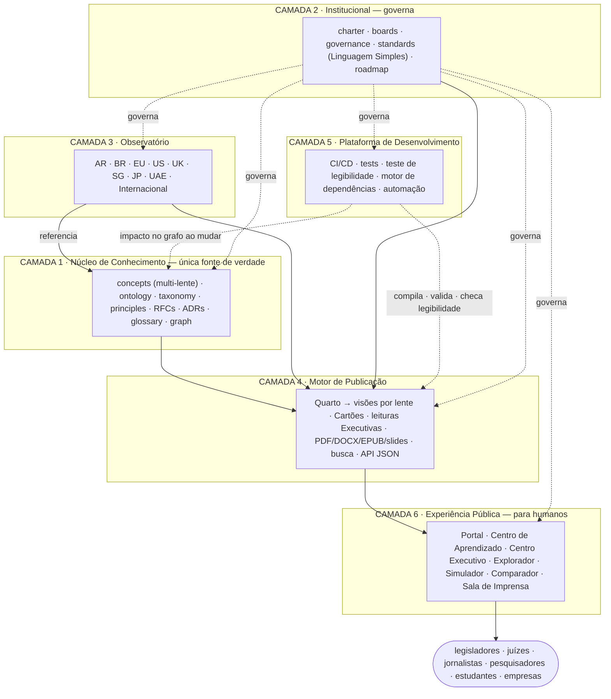

# ADR-0001 — Arquitetura da Plataforma Institucional do BAFLP (v2)

**Status:** APROVADO pelo Editor-Chefe — registrado como o primeiro Registro de Decisão de Arquitetura.
**Substitui:** ARCH-0001 v1 (proposta).
**Prioridade:** CRÍTICA — a implementação avança por fases; a produção de conteúdo segue suspensa até a estrutura de acessibilidade estar pronta.
**Idioma mestre:** inglês · esta é a versão pt-BR · também espelhada em es-AR.

> O BAFLP não é um livro nem um portal. É uma **Plataforma de Conhecimento Viva** — uma instituição
> internacional de pesquisa permanente. Um legislador, juiz, jornalista, pesquisador ou empresa que
> abrir **research.schadler.tech** deve pensar *"centro internacional de pesquisa"*, não *"GitHub
> bonito"*. A v2 acrescenta a camada e as regras que tornam o Framework **acessível para humanos**
> —cidadãos, profissionais e pesquisadores— sem nunca sacrificar o rigor. Os diagramas usam rótulos
> canônicos em inglês; o redesign é aditivo e preserva todo o histórico do git.

---

## 0. O que a v2 acrescenta em relação à v1

- **Camada 6 — Experiência Pública:** tudo com que humanos interagem (não engenheiros).
- Um **modelo de acessibilidade de fonte única e múltiplas lentes:** cada conceito é escrito uma só
  vez, mas renderizado para cidadãos, profissionais e pesquisadores — sem textos paralelos que
  divergem entre si.
- Uma **Política de Linguagem Simples**, exigida por um teste automático de legibilidade no CI.
- Nova estrutura por conceito: um campo `complexity`, três lentes (simples / profissional /
  acadêmica), mais Exemplo, Contraexemplo, Equívocos Frequentes, Implicações Práticas e um Visual.
- Artefatos gerados: **Cartões de Conceito**, leituras do **Centro Executivo** (5 / 15 / 60 min),
  **Simulador de Decisão**, **Comparador Interativo**, **Centro de Aprendizado** (3 níveis).
- Uma **política de automação e edição:** as lentes e cartões são rascunhados automaticamente e
  editados depois por humanos; humanos editam *conteúdo*, nunca o *motor*.

---

## 1. As seis camadas — e onde vivem os dez blocos pedidos

| Camada | Nome | Propósito |
|---|---|---|
| 1 | Núcleo de Conhecimento | Única fonte de verdade (conhecimento canônico) |
| 2 | Institucional | O BAFLP como instituição internacional |
| 3 | Observatório | Monitorar o mundo, por jurisdição |
| 4 | Motor de Publicação | Gerar tudo automaticamente |
| 5 | Plataforma de Desenvolvimento | Engenharia, CI/CD, validação, motor de dependências |
| **6** | **Experiência Pública** | **Tudo com que humanos interagem (NOVO)** |

**Os dez blocos de melhoria não são uma camada só — são três.** Enxergar isso é o que os torna
construíveis:

| Bloco | Vive em | Tipo |
|---|---|---|
| Campo `complexity` | Camada 1 (frontmatter do conceito) | conteúdo |
| Exemplos (exemplo · contraexemplo · equívocos · implicações) | Camada 1 (corpo do conceito) | conteúdo |
| Política de Linguagem Simples | Padrão da Camada 2, exigido pelo CI da Camada 5 | regra |
| Camada Visual (um diagrama por conceito) | Fonte na Camada 1 + render na Camada 4 | conteúdo + gerado |
| Cartões de Conceito (1 página · 3 min · acadêmica · imprimível · slide) | Camada 4 (gerado) | gerado |
| Centro Executivo (leituras de 5 / 15 / 60 min) | Gerado na Camada 4 + superfície na Camada 6 | gerado |
| Centro de Aprendizado (Cidadão · Profissionais · Pesquisadores) | Camada 6 | experiência |
| Simulador de Decisão | Lógica na Camada 6 + doutrina de classificação na Camada 1 | experiência |
| Comparador Interativo | Camada 6 + dados do observatório da Camada 3 | experiência |
| Plataforma de Conhecimento Viva | toda a arquitetura | posicionamento |

**Princípio-chave:** *acessibilidade é uma propriedade do Núcleo de Conhecimento, não uma maquiagem
de front-end.* É exigida na fonte e depois exposta pela camada de Experiência Pública.

---

## 2. Árvore do repositório (v2)

```
baflp/
├── core/                          # CAMADA 1 — Núcleo de Conhecimento (única fonte de verdade)
│   ├── ontology/  taxonomy/  concepts/  principles/  rfcs/
│   ├── adrs/                      #   Registros de Decisão de Arquitetura (este arquivo = ADR-0001) [NOVO]
│   ├── glossary/                  #   gerado a partir do frontmatter dos conceitos                  [NOVO]
│   ├── graph/                     #   grafo de dependências de conhecimento (graph.json)            [NOVO]
│   └── metadata/                  #   esquemas de frontmatter, lentes e complexidade                [NOVO]
│
├── institution/                   # CAMADA 2 — Institucional                                        [NOVO]
│   ├── charter/  boards/  governance/  roadmap/
│   └── standards/                 #   nomenclatura · qualidade · PLAIN-LANGUAGE-POLICY.md           [NOVO]
│
├── observatory/                   # CAMADA 3 — Observatório (por jurisdição)                        [NOVO]
│   ├── argentina/ brazil/ european-union/ united-states/ united-kingdom/
│   └── singapore/ japan/ uae/ international/
│       #   cada: legislation/ bills/ court-decisions/ academic-papers/ government-policies/
│       #         case-studies/ timeline.md status.md impact-assessment.md referenced-concepts.md
│
├── model-law/   registry/         # aplicação do Núcleo
│
├── public-experience/             # CAMADA 6 — Experiência Pública (humanos, não engenheiros)       [NOVO]
│   ├── learning-center/           #   Nível 1 Cidadão · Nível 2 Profissionais · Nível 3 Pesquisadores
│   ├── executive-center/          #   leituras de 5-min · 15-min · 1-hora · completa
│   ├── explorer/                  #   mapa de conhecimento / explorador de conceitos (app do portal)
│   ├── decision-simulator/        #   classificador guiado (árvore de lógica; limiares = doutrina)
│   ├── compare/                   #   visões de comparação de jurisdições (sobre dados do Observatório)
│   ├── press-room/                #   kit de imprensa · releases · notícias · newsletter · destaques
│   └── README.md
│
├── website/   _quarto.yml         # CAMADA 4 — Motor de Publicação (portal gerado; só o tema)
├── scripts/  tools/  tests/  api/  templates/  .github/  docs/   # CAMADA 5 — Plataforma de Desenvolvimento
│
├── bibliography/                  # referências centralizadas (BibTeX + CSL)     — apoia C1
├── assets/ figures/ diagrams/     # mídia reproduzível (SVG · Mermaid)            — apoia C4
├── translations/                  # espelhos es-AR · pt-BR (o inglês é o mestre)  — transversal
├── releases/ downloads/ archive/ examples/ build/
└── CLAUDE.md · README.md · CHANGELOG.md · VERSION · CITATION.cff · LICENSE-CONTENT · LICENSE-CODE
```

O redesign é **aditivo** mais movimentações que preservam o histórico; nada do repositório atual é
sobrescrito.

---

## 3. Diagrama de arquitetura (v2)



---

## 4. O modelo de acessibilidade — "um conceito, várias lentes" (o coração da v2)

A tensão é real: **acessível E rigoroso.** A solução errada são dois textos — um "fácil" e um
"acadêmico" — que divergem e acabam se contradizendo. A solução certa é **uma fonte, várias lentes.**

Cada conceito é escrito **uma única vez** (o significado é do Arquiteto-Chefe de Pesquisa) com campos
estruturados que permitem ao sistema renderizar o *mesmo* conceito através de lentes diferentes:

```yaml
---
id: concept-0003
title: "Artificial Registry"
slug: artificial-registry
version: 0.1.0
status: draft
complexity: intermediate          # beginner | intermediate | advanced          [NOVO]
category:
authority: chief-research-architect
summary: >                        # uma frase; alimenta o glossário
relations: { depends-on: [], related-to: [], supersedes: null }
referenced-by: auto               # preenchido pelo motor do grafo
lenses: { citizen: true, professional: true, researcher: true }  # quais visões gerar [NOVO]
references: []
---

## In one sentence (citizen)         # linguagem simples, sem juridiquês
## In practice (professional)        # o que muda para advogado / empresa / gestor público
## Formal definition (researcher)    # a definição canônica, rigorosa
## Example
## Counterexample
## Frequently misunderstood
## Practical implications
## Visual                            # referência a diagrama (Mermaid/SVG)
## See also                          # referências cruzadas resolvidas automaticamente
```

Desse **único arquivo**, o Motor de Publicação gera: as três visões por lente
(cidadão/profissional/pesquisador), um **Cartão de Conceito** de uma página, uma explicação de três
minutos, uma versão acadêmica, uma versão imprimível, um slide e a entrada do glossário. **Uma fonte,
muitas saídas — sem divergência.** É assim que "acessível" vira mecânica, não promessa.

---

## 5. Política de Linguagem Simples (padrão da Camada 2 · exigida na Camada 5)

Toda publicação oficial deve ser compreensível por um leitor instruído. Todo conceito deve ter uma
definição acadêmica, uma explicação profissional, uma explicação em linguagem simples, um exemplo e
um visual.

**Exigida, não esperada:** um **teste de legibilidade** no CI pontua a lente cidadão; se ficar
difícil demais (acima de um nível-alvo), o build sinaliza o conceito. A acessibilidade é testada.

---

## 6. Componentes da Experiência Pública (Camada 6)

- **Centro de Aprendizado** — *Nível 1 Cidadão* (linguagem simples, exemplos, ilustrações, sem
  juridiquês); *Nível 2 Profissionais* (advogados, engenheiros, empreendedores, gestores públicos);
  *Nível 3 Pesquisadores* (linguagem acadêmica, referências, teoria completa).
- **Centro Executivo** — leituras de 5 minutos, 15 minutos, 1 hora e completa. Deputados, juízes,
  ministros e executivos não vão ler 600 páginas; vão ler um resumo de 5 minutos.
- **Simulador de Decisão** — um classificador guiado baseado em dados (ex.: os níveis ALP). O usuário
  responde *"tem supervisão humana? tem patrimônio? pode contratar?"* e recebe uma classificação com
  os conceitos e precedentes por trás. A casca é Camada 6; os limiares de classificação são
  **doutrina** (Camada 1, gated por RFC) — até serem aprovados, roda em modo ilustrativo/rascunho.
- **Comparador Interativo** — jurisdições lado a lado (Argentina · Brasil · UE · EUA …) sobre dados
  do Observatório, para ver as diferenças sem ler centenas de páginas.
- **Explorador / Mapa de Conhecimento** — o grafo de conhecimento interativo como superfície de
  navegação.
- **Sala de Imprensa** — kit de imprensa, releases, notícias, newsletter, destaques de pesquisa,
  conceitos e estudos de caso em destaque.

**Gerado vs interativo:** os Cartões e as leituras Executivas são *gerados* (Camada 4) a partir do
conteúdo do conceito; o Simulador, o Comparador, o Explorador e o Centro de Aprendizado são
*superfícies interativas* (Camada 6). O portal segue estático + progressivo — sem necessidade de um
framework SPA pesado.

---

## 7. Pilha tecnológica (acréscimos da v2)

Tudo da v1 (Quarto · GitHub Actions · Pagefind · grafo em Python/D3 · GitHub Pages · SemVer ·
Mermaid) mais:

| Aspecto | Tecnologia | Por que |
|---|---|---|
| Controle de legibilidade | Métrica de legibilidade em Python (+ regras de prosa Vale opcionais) no CI | Testa a Política de Linguagem Simples automaticamente |
| Simulador de Decisão | Árvore baseada em dados (YAML/JSON) renderizada por um script do portal | A lógica é dado; a doutrina fica no Núcleo |
| Comparador Interativo | Visão de dados sobre o Observatório + `graph.json` | Sem conteúdo duplicado; lê da fonte |
| Cartões / visões por lente | Script gerador sobre as seções do conceito → páginas/tabsets Quarto | Uma fonte, muitas saídas |

---

## 8. Pipeline de build e publicação (acréscimos da v2)

O **build** (`scripts/build.sh`) agora também: renderiza as três visões por lente de cada conceito;
gera Cartões e leituras Executivas; constrói os dados do Simulador e do Comparador; e **roda o teste
de legibilidade** como parte da validação. A **publicação** não muda (push → deploy no Pages; tag →
release + arquivo versionado). Continua um comando; continua sem passos manuais.

---

## 9. Grafo de dependências (sem mudança — com uma nota)

O modelo multi-lente **não** divide o grafo. Lentes são visões de um mesmo nó, então um conceito
continua sendo um único nó com um único conjunto de relações. Mudar um conceito continua mostrando
cada documento afetado — em todas as lentes — pelo mesmo motor de impacto.

---

## 10. Responsabilidades das pastas (acréscimos da v2)

| Pasta | Camada | Responsabilidade | Autoridade |
|---|---|---|---|
| `public-experience/*` | C6 | Superfícies para o público (Aprendizado/Executivo/Simulador/Comparador/Imprensa) | Conselho Editorial + Engenharia |
| `institution/standards/PLAIN-LANGUAGE-POLICY.md` | C2 | A regra de acessibilidade | Editor-Chefe |
| `core/metadata/` (esquema de lentes + complexidade) | C1 | A forma dos conceitos acessíveis | Arquiteto + Engenharia |
| *(todas as linhas da v1 permanecem)* | | | |

---

## 11. Riscos (acréscimos da v2)

| Risco | Severidade | Mitigação |
|---|---|---|
| Divergência "acessível" vs "rigoroso" | — | **Eliminada pelas lentes de fonte única** (sem textos paralelos) |
| O Simulador é tão bom quanto sua doutrina | Média | Sai em modo ilustrativo até a classificação ALP ser aprovada por RFC |
| Qualidade variável das lentes autogeradas | Média | Portão de validação humana; o motor nunca é editado para remendar conteúdo (§13) |
| Crescimento descontrolado da Experiência Pública (imprensa, newsletter…) | Média | Por fases: o portal sai primeiro com Centro de Aprendizado + Explorador + Cartões |

*(Permanecem os riscos da v1: links de migração · deriva do grafo · carga do Observatório · gargalo
de mantenedor único · limitação multiversão do Quarto · deriva de tradução · dependência do GitHub.)*

---

## 12. Escalabilidade (nota da v2)

As lentes escalam por **geração**, não por trabalho de autoria extra além dos campos estruturados.
Adicionar uma quarta lente depois (ex.: "estudante") é uma mudança de template + gerador — não uma
reescrita de cada conceito.

---

## 13. Política de automação e edição (decisão do Editor-Chefe)

- **Por ora, tudo automatizado.** As lentes, exemplos, Cartões e leituras Executivas são
  **rascunhados pela esteira multi-IA** e commitados.
- **O Editor-Chefe edita depois** — direto nos arquivos de conteúdo (a prosa das lentes do conceito).
- **As edições nunca tocam o motor principal.** Humanos editam *conteúdo* (`core/concepts/*`,
  `observatory/*`); o *motor* (`scripts/`, configuração de build, geradores) muda só por um PR de
  engenharia, nunca para consertar um conteúdo pontual. O gerador permanece estável enquanto o
  conteúdo segue livremente editável.

---

## 14. Plano de migração (v2)

Cada fase é seu próprio PR validado e reversível. O histórico é preservado o tempo todo.

- **Fase 0 — Preservar.** Tagar o snapshot atual.
- **Fase 1 — Andaime aditivo.** Criar `institution/`, `observatory/`, `public-experience/`,
  `core/{adrs,graph,glossary,metadata}`; adicionar a **Política de Linguagem Simples** e o **template
  de conceito multi-lente**; registrar **ADR-0001** (este documento).
- **Fase 2 — Movimentações que preservam o histórico.** `comparative-law/` + estudos de caso →
  `observatory/`; **o PR #2 (Argentina) é mergeado e depois migra para `observatory/argentina/`.**
- **Fase 3 — Motores.** Motor de dependências (`graph-build`, `graph-impact`, `graph-integrity`) +
  o teste de legibilidade.
- **Fase 4 — Portal.** Navegação de seis camadas, visões por lente, Cartões, Centro Executivo, Mapa
  de Conhecimento, Centro de Aprendizado, seletores de versão/idioma.
- **Fase 5 — Interatividade da Experiência Pública.** Simulador de Decisão, Comparador Interativo,
  Sala de Imprensa; empacotamento de releases, arquivo de versões, API JSON.

---

## 15. O posicionamento — uma Plataforma de Conhecimento Viva

Tudo é vivo: versionado, relacionado, exemplificado, explicado em três profundidades, com infográficos
e (mais adiante) vídeo. A plataforma é construída para que, se a ONU, a OCDE, uma universidade ou um
parlamento quiserem colaborar amanhã, a estrutura já receba pesquisadores, revisores e novos estudos
**sem ser reinventada.** research.schadler.tech vira **o lugar para onde o mundo vai para entender
personalidade jurídica artificial** — cidadão, juiz, jornalista, ministro, universidade — com
linguagem simples para quem chega e profundidade completa para pesquisadores e legisladores.

---

## 16. Portão de decisão — APROVADO

O Editor-Chefe aprovou a Camada 6 e o modelo de acessibilidade de fonte única e múltiplas lentes.
Este documento é registrado como **ADR-0001**; a implementação avança pelo plano em fases da §14. A
produção de conteúdo é retomada assim que a estrutura de acessibilidade (Fase 1) estiver no lugar.
